# CUE Schema Logic — Mermaid-Diagramme

> **Stand:** 2026-04-07
> **Scope:** Visualisierung der tatsaechlich implementierten CUE-Logik (bis jetzt)
> **Quellen:** `base/*.cue`, `base/generated/*.cue`, `base-kit/*.cue`, `modules/*/module.cue`

---

## 1. Schema-Hierarchie

Wie die CUE-Definitionen aufeinander aufbauen:

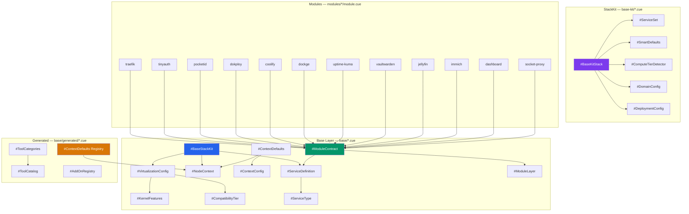

---

## 2. Context-Defaults — `#ContextDefaults`

Was CUE je nach `_context` auflöst (`base/context.cue`):

```mermaid
flowchart TD
    Input["_context: #NodeContext"] --> Switch{"_context?"}

    Switch -- '"local"' --> Local["TLS: self-signed<br/>ACME: false<br/>PAAS: dokploy<br/>Tier: standard<br/>Memory: 1.0x<br/>CPU: 1024 shares<br/>Arch: amd64<br/>Access: ports<br/>Public IP: false<br/>Storage: overlay2"]

    Switch -- '"cloud"' --> Cloud["TLS: letsencrypt<br/>ACME: true<br/>PAAS: coolify<br/>Tier: standard<br/>Memory: 1.0x<br/>CPU: 1024 shares<br/>Arch: amd64<br/>Access: proxy<br/>Public IP: true<br/>Storage: overlay2"]

    Switch -- '"pi"' --> Pi["TLS: self-signed<br/>ACME: false<br/>PAAS: dockge<br/>Tier: low<br/>Memory: 0.5x<br/>CPU: 512 shares<br/>Arch: arm64<br/>Access: ports<br/>Public IP: false<br/>Storage: overlay2"]

    style Input fill:#2563eb,color:#fff
    style Local fill:#22c55e,color:#fff
    style Cloud fill:#06b6d4,color:#fff
    style Pi fill:#a855f7,color:#fff
```

### Generated Registry (`base/generated/contexts.cue`)

Ergaenzt identische Logik mit Admin-DB-Werten:

| Context | defaultPaas | defaultTlsMode | defaultComputeTier | memoryLimitMB | cpuShares | dnsStrategy | backupTarget |
|---------|-------------|----------------|--------------------|---------------|-----------|-------------|--------------|
| LOCAL | dokploy | self-signed | standard | 4096 | 1024 | local-dns | local-nas |
| CLOUD | coolify | letsencrypt | standard | 2048 | 1024 | cloud-dns | s3 |
| PI | dockge | self-signed | low | 256 | 512 | mdns | local-nas |

---

## 3. ComputeTier-Erkennung — `#ComputeTierDetector`

`base-kit/defaults.cue`:

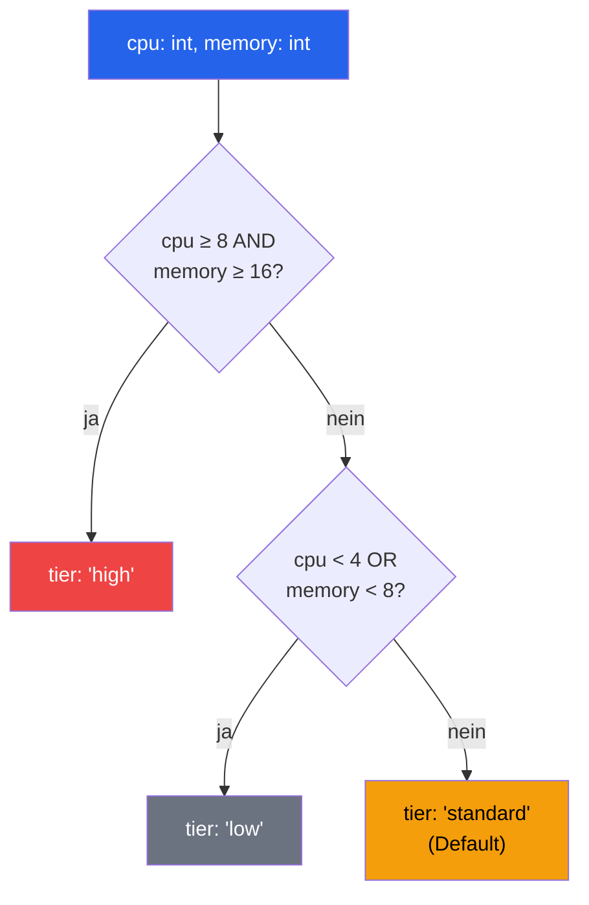

---

## 4. SmartDefaults — `#SmartDefaults`

Was CUE je nach `computeTier` aktiviert (`base-kit/defaults.cue`):

```mermaid
flowchart TD
    Tier["computeTier"] --> Switch{"Wert?"}

    Switch -- '"high"' --> High["monitoring: full<br/>management: advanced<br/>logging: full<br/>Services: traefik, dockge, dozzle,<br/>netdata, portainer, prometheus, grafana<br/><br/>Docker: mem 4g, cpu 4.0, max 50<br/>Traefik: accessLog, metrics, tracing<br/>Backup: alle 6h, 14d/8w/12m"]

    Switch -- '"standard"' --> Std["monitoring: standard<br/>management: basic<br/>logging: basic<br/>Services: traefik, dockge,<br/>dozzle, netdata<br/><br/>Docker: mem 1g, cpu 1.0, max 20<br/>Traefik: metrics only<br/>Backup: taeglich 3 Uhr, 7d/4w/6m"]

    Switch -- '"low"' --> Low["monitoring: minimal<br/>management: minimal<br/>logging: basic<br/>Services: traefik, dockge,<br/>dozzle, glances<br/><br/>Docker: mem 512m, cpu 0.5, max 10<br/>Traefik: minimal<br/>Backup: woechentlich So, 3d/2w/1m"]

    style Tier fill:#2563eb,color:#fff
    style High fill:#ef4444,color:#fff
    style Std fill:#f59e0b,color:#000
    style Low fill:#6b7280,color:#fff
```

---

## 5. Deployment Mode — `#DeploymentConfig`

CUE-Konditionallogik in `base-kit/stackfile.cue`:

```mermaid
flowchart TD
    Mode["mode"] --> Switch{"Wert?"}

    Switch -- '"simple"' --> Simple["day1:<br/>  engine: opentofu<br/>  actions: init, plan, apply<br/>day2:<br/>  enabled: false"]

    Switch -- '"advanced"' --> Advanced["day1:<br/>  engine: opentofu<br/>  actions: init, plan, apply<br/>day2:<br/>  enabled: true<br/>  engine: terramate<br/>  actions: drift, update, destroy<br/>  features:<br/>    drift_detection: true<br/>    change_sets: true<br/>    rolling_updates: true<br/>    stack_ordering: true"]

    style Mode fill:#2563eb,color:#fff
    style Simple fill:#22c55e,color:#fff
    style Advanced fill:#7c3aed,color:#fff
```

---

## 6. Virtualisierung — `#VirtualizationConfig`

Kompatibilitaets-Tiers in `base/virtualization.cue`:

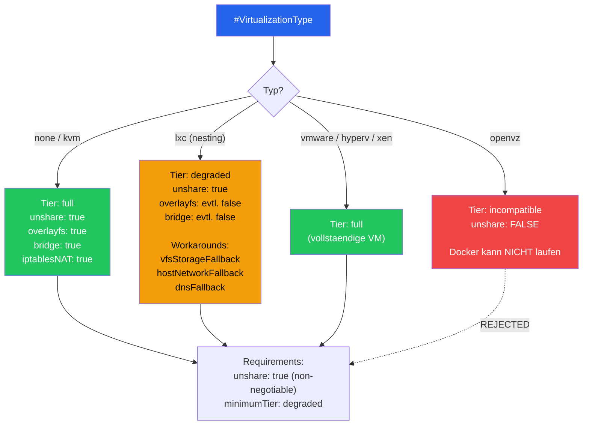

### Auto-Workarounds (`#AutoWorkarounds`)

| Workaround | Default | Beschreibung |
|------------|---------|------------|
| `vfsStorageFallback` | true | Fallback auf vfs wenn overlay2 nicht geht |
| `hostNetworkFallback` | true | Host-Networking wenn Bridge geblockt |
| `dnsFallback` | true | 1.1.1.1 / 8.8.8.8 injizieren |
| `hostPrePull` | true | Images ueber Host-DNS vorziehen |
| `iptablesLegacyFallback` | true | iptables-legacy wenn nf_tables fehlschlaegt |

---

## 7. Tool-Kategorie-System — `#ToolCategories`

`base/generated/tool_catalog.cue` — Admin-DB-generiert:

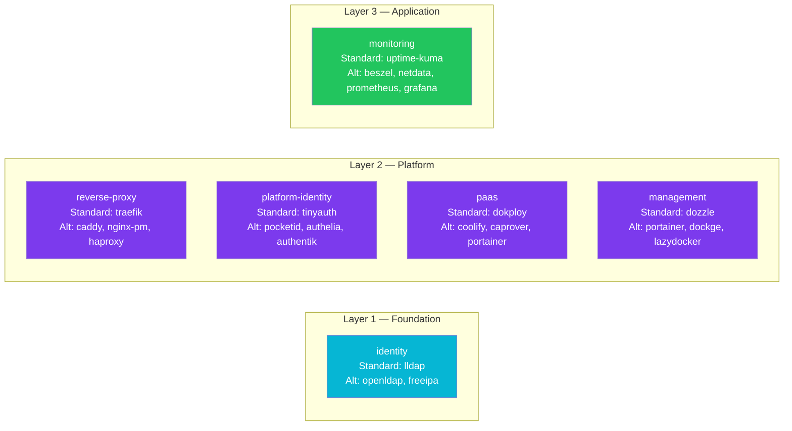

---

## 8. ModuleContract-Struktur — `#ModuleContract`

Jedes Modul in `modules/*/module.cue` folgt diesem Schema (`base/module.cue`):

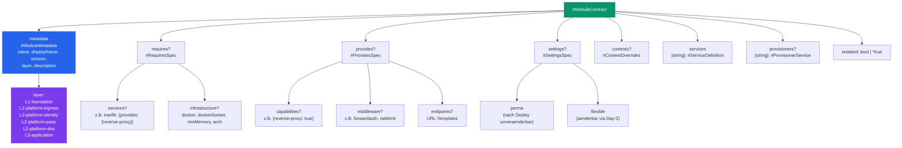

---

## 9. Service-Definitionen — `#ServiceDefinition`

Vollstaendige Struktur aus `base/stackkit.cue`:

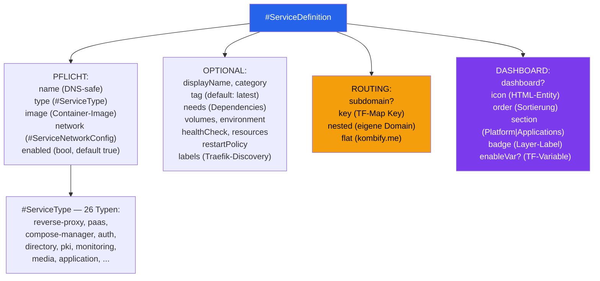

---

## 10. Domain-Berechnung — `#DomainConfig`

CUE-Comprehension in `base-kit/defaults.cue`:

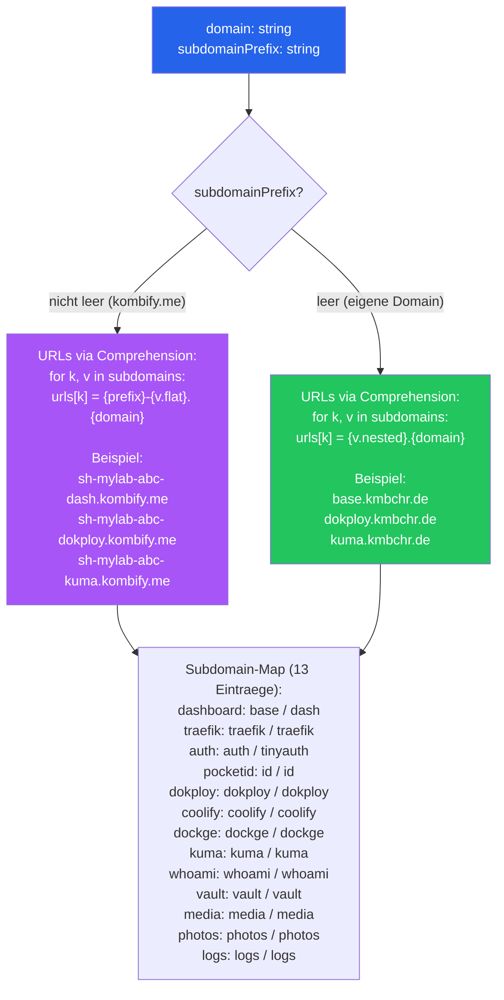

---

## 11. Constraint-Validierung

CUE-Validierungen die beim `cue vet` greifen:

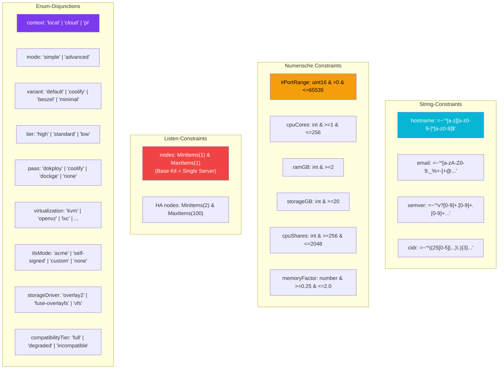

---

## 12. Layer-Architektur in CUE

Wie die 3 Layer in CUE abgebildet sind:

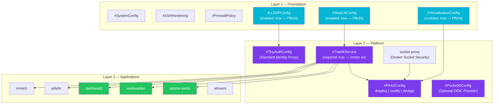

---

## 13. HA-Kit Quorum-Logik

CUE-Konditionals fuer Docker Swarm (`ha-kit/stackfile.cue`):

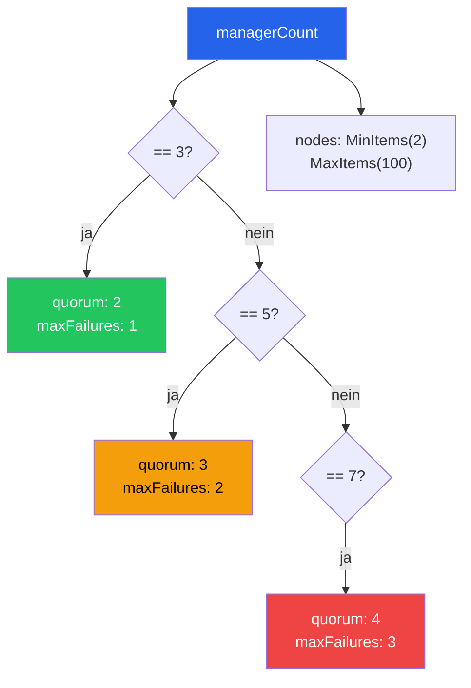

---

## 14. Addon-System — `#AddOnBase`

Struktur (`base/context.cue`) + Registry (`base/generated/addons.cue`):

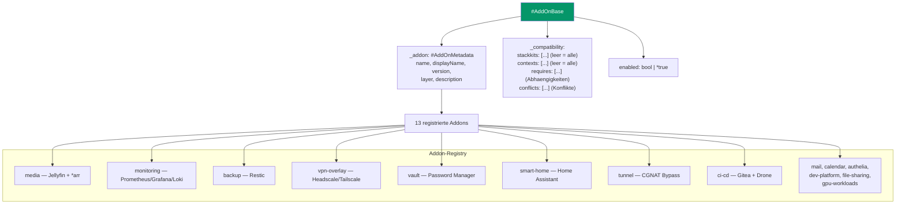

---

## 15. Gesamtfluss: Input → CUE → Output

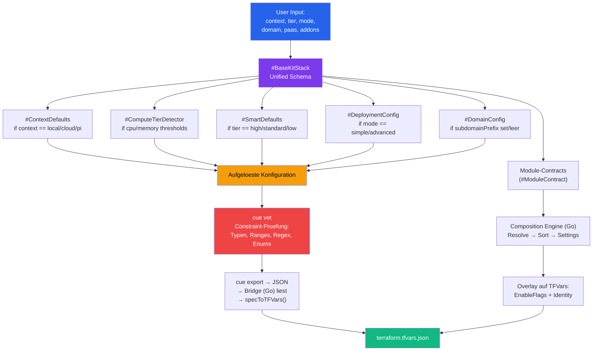
