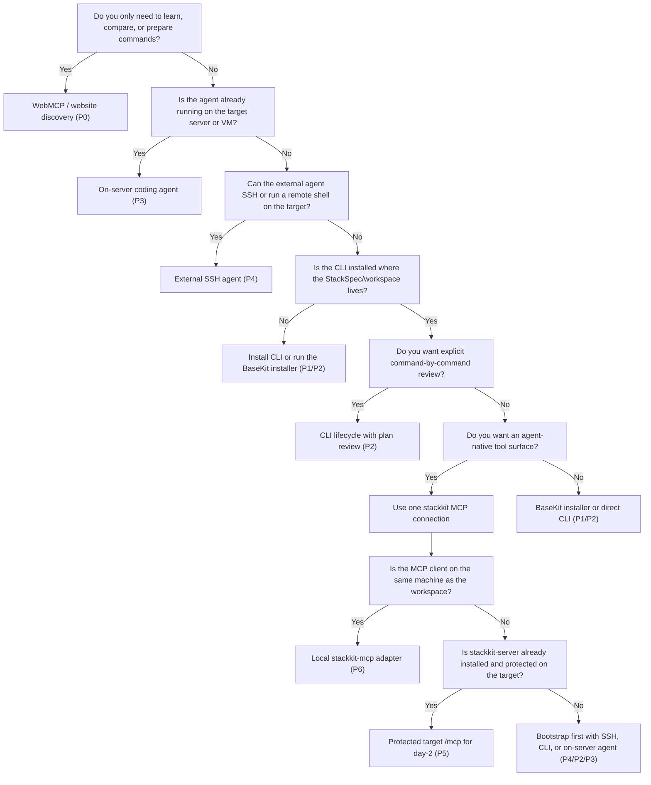

# StackKits Installation Processes

> Last verified: 2026-06-08

This specification defines the supported ways a user or agent can install and roll out a StackKit. It separates discovery, installation, execution authority, and post-install management so agents do not confuse a read-only website surface with a target-server control surface.

## Scope

This document covers StackKits OSS/S1 installation and rollout paths:

- read-only website and Web-MCP discovery;
- full one-line installer execution;
- shared CLI installer plus manual or agent-guided CLI workflow;
- agent execution on the target server;
- external agent execution through SSH or equivalent remote shell;
- native MCP connector execution through `stackkit-server` or `stackkit-mcp`, with remote connector operation treated as a target/day-2 capability rather than a default first-install path.

Out of scope:

- managed-serverless provisioning;
- SaaS placement orchestration beyond StackKits S1;
- `stackkit app add` or customer-owned app lifecycle deployment;
- internal Kombify operator MCPs.

## User-Facing MCP Model

Users should see one MCP connection: `stackkit`.

Implementation details:

| Runtime form | Binary or endpoint | User-facing meaning |
| --- | --- | --- |
| Local adapter | `stackkit-mcp` stdio or loopback HTTP | The `stackkit` MCP connection on the same machine as the CLI/workspace |
| Durable endpoint | `stackkit-server POST /mcp` | The same `stackkit` MCP connection after install, exposed only through a protected access path |
| App authoring | `mcp-use/stackkits-app` | Build/Inspector layer for `ui://stackkits/onboarding.html`, not a production connector |

This means `P5` and `P6` are not different MCP products. They differ only by where the same `stackkit` connection is hosted and which authority boundary applies.

## Common Contract

All installation paths share the same underlying lifecycle:

```text
discover -> collect intent -> install toolchain -> init -> prepare -> validate -> generate -> plan -> apply -> verify -> preserve evidence
```

Source-of-truth rules:

- `stack-spec.yaml` and CUE contracts are the editable contract.
- Generated `deploy/`, OpenTofu state, `.stackkit/state.yaml`, logs, run evidence, and snapshots are outputs.
- Agents must not hand-edit generated rollout artifacts.
- BaseKit is the verified beta one-click path.
- Unreleased kit definitions stay outside the public beta install surface until their rollout matrices graduate.

Minimum user intent:

| Input | Purpose | Default or current stance |
| --- | --- | --- |
| Owner/admin email | Bootstrap identity and technical admin material | Required for production-like or cloud/custom-domain paths; local-only can synthesize `admin@example.com` where supported |
| StackKit | Which kit to install | `base-kit` for verified beta |
| Install mode | Product bootstrap depth | `bootstrapped`; valid values are `bare`, `bootstrapped`, `advanced` |
| Context | Target environment | `local`, `cloud`, or `pi` |
| Domain strategy | Routing and user links | `home.localhost`, `kombify.me`, custom domain, or LAN DNS |
| Workspace/spec path | Where the deployment contract lives | `./stack-spec.yaml` in the selected workspace |
| Target access | Local shell, SSH, or MCP endpoint | Depends on process variant |
| Write approval | Permission to mutate the target | Explicit operator approval; MCP write tools also require `STACKKIT_MCP_ALLOW_WRITE=true` |

Common evidence:

- latest run ID and `.stackkit/runs/<runId>/` evidence;
- `stackkit verify --http --json` output when HTTP routes are expected;
- relevant `stackkit logs` output;
- final Hub URL for local BaseKit: `http://base.home.localhost`;
- confirmation that generated artifacts were not hand-edited.

## Core Decisions Before Install

Every StackKits installation path should collect the same small set of decisions. The method changes how those decisions are collected and executed, not what the product contract needs.

| Decision | Why it matters | Typical values |
| --- | --- | --- |
| Execution place | Defines who can mutate the target | Website-only planning, local CLI, on-server agent, external SSH agent, local MCP, protected target MCP |
| Authority boundary | Defines the security model | No target authority, local shell, SSH user, local process, token-protected target MCP |
| StackKit | Selects the CUE contract and rollout matrix | `base-kit` beta |
| Install mode | Controls bootstrap depth and default setup policy | `bare`, `bootstrapped`, `advanced` |
| Target context | Selects environment defaults, not a private-network assumption | `local`, `cloud`, `pi` |
| Domain strategy | Determines routing, access links, and DNS/TLS evidence | browser-native `.localhost`, `kombify.me`, custom domain, LAN DNS |
| Owner/admin email | Seeds identity, platform setup, and technical bootstrap material | operator email, tenant-provided owner, synthetic local-only email for tests |
| PaaS/platform | Determines where StackKit-owned apps are registered | Coolify default, Komodo beta-supported, Dokploy draft |
| Service profile | Controls how much of the default application surface is enabled | `default`, `admin-only` |
| Apply approval | Separates preview from mutation | explicit shell approval or MCP write gate |

The most important rule for agents: do not treat `P0` website/Web-MCP discovery as authority. It can decide and prepare. Execution happens later through CLI, SSH, an on-server agent, or the native `stackkit` MCP connector.

## What StackSpec And Config Can Express

StackKits configuration is intentionally broad enough to support a guided agent workflow without hand-editing generated rollout files. The user-facing inputs map to `stack-spec.yaml`, CLI flags, environment variables, or `stackkit-server` settings.

| Capability | Config surface | Notes |
| --- | --- | --- |
| Owner and admin intent | `adminEmail`, `owner.*`, CLI `--admin-email`, owner bootstrap flags | `adminEmail` is compatibility input; Owner fields are the stronger identity contract when present. |
| Kit selection | `stackkit`, installer argument, `stackkit init <kit>` | `base-kit` is the verified beta path. |
| Install mode | `mode`, `STACKKIT_MODE`, `--mode` | `bare` is minimal/manual, `bootstrapped` is default, `advanced` is the Terramate Plus lifecycle with Runtime/Frontend Intelligence and managed TechStack handoff. |
| Target context | `context`, `--context`, `KOMBIFY_CONTEXT` | `local` means local/default runtime assumptions, not a dependency on a home network. |
| Domain strategy | `domain`, `localDns`, `DOMAIN`, `STACKKIT_LOCAL_DOMAIN`, DNS provider env | Default local links use browser-native `.localhost`; public/custom domains require DNS/TLS proof. |
| Service profile | `serviceProfile`, `STACKKIT_SERVICE_PROFILE`, `--service-profile` | `admin-only` keeps platform/admin services while deferring L3 application setup. |
| Compute and topology | `compute.tier`, `nodes[]`, `node.role` | Used by CUE to select resources and placement constraints. |
| PaaS selection | `paas`, `STACKKIT_PLATFORM`, `STACKKIT_PAAS`, platform credential env | Coolify is default; Komodo is beta-supported; Dokploy remains draft. |
| Setup policy | `bootstrap.*`, `application.*.setup.policy`, `services.*.setup.policy` | Valid values are `manual`, `on_demand`, `automatic`. |
| Demo data | `demoData.enabled` | Explicit opt-in only. |
| MCP write mode | `STACKKIT_MCP_ALLOW_WRITE`, `--mcp-allow-write` | Read-only tools stay available; mutating tools require explicit write mode. |
| Remote MCP protection | `STACKKIT_MCP_TOKEN`, `--mcp-token`, proxy/tunnel/VPN config | Non-loopback target MCP is a protected day-2 posture. |

Generated `deploy/`, `.stackkit/state.yaml`, OpenTofu files, Compose files, tfvars, snapshots, and run logs remain outputs. If an installation method needs a different result, change StackSpec/CUE/Go inputs and regenerate.

## Automation And Individualization Axes

Installation variants must be described on two independent axes:

- Automation degree: how much of the lifecycle StackKits or an agent executes without the user typing each command.
- Individualization degree: how much the user changes from the default BaseKit path before rollout.

### Automation Levels

| Level | Name | User experience | Typical execution |
| --- | --- | --- | --- |
| `A0` | Discovery only | User or agent reads docs and chooses a path | Website, `llms.txt`, OpenMCP discovery |
| `A1` | Manual CLI | User runs each lifecycle command | `install -> init -> prepare -> generate -> plan -> apply -> verify` |
| `A2` | Guided agent | Agent proposes/runs steps, user supplies intent and approvals | Prompted CLI, MCP App onboarding, SSH agent |
| `A3` | Autonomous approved rollout | User supplies minimum intent, agent/installer executes the rollout | BaseKit one-line installer, agent on target with approved plan |
| `A4` | Durable connector operation | Target-local connector performs config/update/verify/log workflows for an external agent after the StackKit is installed | `stackkit-server POST /mcp` with token and write gate |

Automation does not remove approval. Mutating operations still require either shell authority, SSH authority, or MCP write-mode authority.

### Individualization Levels

| Level | Name | User choices | Typical examples |
| --- | --- | --- | --- |
| `I0` | Default BaseKit | No meaningful choices beyond accepting defaults | Local `home.localhost`, BaseKit, default profile |
| `I1` | Identity and workspace | Email, stack name, workspace/spec path | `--admin-email`, `HOMELAB_DIR`, `stack-spec.yaml` |
| `I2` | Core rollout profile | Kit, install mode, context, compute tier, service profile | `base-kit`, `bootstrapped`, `cloud`, `admin-only` |
| `I3` | Network/platform target | Domain strategy, SSH target, custom DNS/TLS, selected PaaS | `kombify.me`, custom domain, Cloudflare token, Coolify/Komodo |
| `I4` | Advanced composition | Add-ons, advanced mode, explicit owner/recovery policy, stateful updates | monitoring add-on, `advanced`, custom owner bootstrap |

Higher individualization increases review and evidence needs. For example, `I3` custom domains require DNS/TLS proof, while `I4` advanced composition requires explicit validation that generated artifacts still come from StackSpec/CUE and not hand edits.

## Automation x Individualization Map

| Path | Automation range | Individualization range | Notes |
| --- | --- | --- | --- |
| `P0` Website and Web-MCP discovery | `A0` | `I0-I4` planning only | Can explain every option, but cannot execute target actions |
| `P1` Full BaseKit one-line installer | `A3` | `I0-I3` | Highest automation; customization happens through environment variables before launch |
| `P2` Shared CLI installer plus direct CLI | `A1-A2` | `I0-I4` | Most transparent path; every step can be reviewed before mutation |
| `P3` Agent already on target server | `A2-A3` | `I0-I4` | Agent can run CLI directly; authority is the server shell user |
| `P4` External agent through SSH/remote shell | `A2-A3` | `I1-I4` | Good for remote targets before MCP is installed |
| `P5` Protected durable StackKits MCP endpoint | target `A4` | `I1-I4` | Future/durable StackKit-owned day-2 path after `stackkit-server` exists and remote access is explicitly enabled |
| `P6` Local StackKits MCP adapter | `A2` | `I1-I4` | Local MCP client uses `stackkit-mcp` without exposing HTTP |

Recommended product defaults:

- Lowest-friction public path: `P1` with `A3/I0-I1`.
- Safest review-heavy path: `P2` with `A1/I2-I4`.
- Target StackKit-owned day-2 path after CLI/server install: `P5` with `A4/I1-I4`.
- Best first contact for a web agent: `P0` with `A0`, then transition to `P1`, `P2`, `P3`, or `P4`; later transition to `P5` only after a target connector exists.

## Three-Pillar Comparison

Use this table when choosing the user-facing installation path. The three pillars are:

- Configuration and individualization: how many choices the user can safely express before rollout.
- Access options: where the actor can execute and which authority boundary applies.
- Automation degree: how much of the lifecycle is performed automatically.

| Process | Configuration / individualization | Access options | Automation degree | Default user journey |
| --- | --- | --- | --- | --- |
| `P0` Website and Web-MCP discovery | Very broad planning range (`I0-I4`), but no direct config write. Agent can collect email, kit, domain, mode, target, and approval intent. | Public website, browser, web-capable agent, read-only OpenMCP. No target credentials. | `A0` discovery only. | User asks an agent to inspect StackKits; agent reads public context and recommends an execution channel such as `P1`, `P2`, `P3`, or `P4`. |
| `P1` Full BaseKit one-line installer | Low to medium (`I0-I3`). Defaults work with minimal input; customization is mainly env vars such as email, mode, service profile, domain, context, PaaS. | Direct shell on target server with root/sudo. Can be run by user, on-server agent, or SSH agent. | High (`A3`). Installer executes install, prepare, init, generate, apply, verify-oriented output. | User provides minimal intent, runs one command, receives access summary and bootstrap material. |
| `P2` Shared CLI installer plus direct CLI | Full range (`I0-I4`). Best for reviewing StackSpec, generated preview, plan, add-ons, advanced owner/recovery policy, custom network/platform choices. | Local shell on target or operator workstation, depending on workspace/target flags. Root/sudo only when preparing local host. | Low to guided (`A1-A2`). User or agent runs each command. | Install CLI, create/edit spec, run prepare/validate/generate/plan, then approve apply. |
| `P3` Agent already on target server | Full range (`I0-I4`) if the agent has enough local context and approval. Good for default and advanced flows. | Agent has direct target-shell authority. Website/prompting is guidance only. | Guided to autonomous (`A2-A3`). | Agent reads prompts/docs, asks for missing intent, executes CLI locally, reports evidence. |
| `P4` External agent through SSH/remote shell | Medium to full (`I1-I4`). Strong for target host, SSH user/key, email, domain, custom install mode, and remote evidence. | Agent outside server with SSH or equivalent remote shell. Authority is SSH user privileges. | Guided to autonomous (`A2-A3`). | Agent confirms target safety, downloads installer or CLI on target, runs lifecycle remotely, returns logs/evidence. |
| `P5` Protected durable StackKits MCP endpoint | Medium to full (`I1-I4`) through typed tools and MCP App onboarding. Best for future StackKit-owned config/update/verify/log day-2 operations after install. | Agent outside server connects to target `stackkit-server /mcp` over a protected endpoint, tunnel, VPN, or private network. Token, transport security, and write gate are required for mutation. | Durable connector target (`A4`), not a current primary first-install path. | Installed StackKit keeps `stackkit-server` running; external agent starts read-only, then uses write tools only after explicit write-mode approval. |
| `P6` Local StackKits MCP adapter | Medium to full (`I1-I4`) on the local workspace. Good when the MCP client and StackKit workspace are colocated. | Same-machine MCP client using `stackkit-mcp` stdio or loopback HTTP. Local process authority. If launched through SSH, the authority boundary is still `P4`. | Guided (`A2`). | User configures one `stackkit` MCP connection; agent reads resources/tools and drives local CLI-equivalent operations where enabled. |

Decision rules:

- Choose `P1` when automation matters more than review and the target is fresh.
- Choose `P2` when individualization and explicit review matter most.
- Choose `P4` when the agent is outside the server and must bootstrap it before any native connector exists.
- Choose `P5` only when the server already exposes `stackkit-server /mcp` through an explicit protected access path and the goal is durable StackKit-owned day-2 management.
- Choose `P6` when the MCP client and workspace are on the same machine and an HTTP connector is unnecessary.

## User-Facing Method Groups

For users, the product should present five method groups. The internal `P*` IDs only explain authority boundaries and rollout shapes.

| User-facing method | Internal paths | Individualizability | Access options | Automatisability | When to choose it |
| --- | --- | --- | --- | --- | --- |
| CLI | `P1`, `P2` | `P1`: low to medium through env vars. `P2`: full through StackSpec, flags, and plan review. | Shell on the target or a controlled operator shell. SSH can be used to run the same commands remotely. | `P1` is highly automated; `P2` is manual to guided. | Choose CLI when users want the clearest, most inspectable product path. |
| Native MCP | `P5`, `P6` | Medium to full through typed tools and the MCP App onboarding resource. | Same-machine `stackkit-mcp` or protected target `stackkit-server /mcp`. | Guided locally; durable day-2 remotely after install. | Choose MCP when an agent should manage StackKits through a narrow tool surface instead of arbitrary shell commands. |
| WebMCP / website discovery | `P0` | Planning across the full range, but no target mutation. | Public website, `llms.txt`, `/openmcp.json`, docs, schemas, OpenAPI. | Discovery only. | Choose WebMCP first when an agent needs to learn StackKits and decide the execution path. |
| External SSH agent | `P4` | Medium to full; strong for target host, domain, user, key, mode, and evidence choices. | Agent outside the server with SSH or equivalent remote shell. | Guided to autonomous after target approval. | Choose SSH when no native MCP endpoint exists yet and the agent must bootstrap a remote server. |
| On-server coding agent | `P3` | Full, as long as the agent has local context and explicit approval. | Agent is already inside the target VM/server shell. | Guided to autonomous. | Choose this when the agent already runs on the target and can use CLI directly. |

Recommended simplification for the product UI: show one `stackkit` MCP connection, not separate MCP products. The user chooses where that connection runs: local adapter (`P6`) or protected target endpoint (`P5`) after installation.

## P0/P4/P5/P6 Relationship

These paths are easy to confuse because an agent may be involved in all of them. The distinction is not "agent or no agent"; it is the execution authority.

| Path | What it is | What it is not | Authority boundary |
| --- | --- | --- | --- |
| `P0` | Public discovery and decision support. The agent learns installers, prompts, schemas, and local connector metadata from `stackkit.cc`. | A server control plane. It cannot install or mutate anything by itself. | None on the target. |
| `P4` | External agent uses SSH or another remote shell to run installer/CLI commands on the target. | MCP transport. The website may provide instructions, but SSH is what executes. | SSH user privileges on the target. |
| `P5` | External agent connects to an already-running target-local MCP endpoint for durable read/verify/log/update workflows. | A current default first-install path. It needs `stackkit-server` first. | MCP token/scope/write-gate policy on the target. |
| `P6` | Local adapter form of the same `stackkit` MCP connection beside the CLI/workspace. | Remote management by itself. If a client reaches it via SSH command execution, the real authority is `P4`. | Local process authority. |

Typical progression:

```text
P0 discovery -> choose P1/P2/P3/P4 for initial install -> optional P5 once stackkit-server is installed and explicitly exposed for day-2
```

## Installation Matrix

| ID | Process | Agent location | Main entrypoint | Automation | Individualization | Execution authority | Best fit |
| --- | --- | --- | --- | --- | --- | --- | --- |
| `P0` | Website and Web-MCP discovery | Browser or remote agent | `https://stackkit.cc`, `/llms.txt`, `/openmcp.json` | `A0` | `I0-I4` planning | Read-only | Learn, choose a path, generate commands |
| `P1` | Full BaseKit one-line installer | Target server shell | `curl -sSL https://base.stackkit.cc \| sh` | `A3` | `I0-I3` | Target shell/root or sudo | Fastest fresh-server BaseKit rollout |
| `P2` | Shared CLI installer plus direct CLI | User or agent shell | `curl -sSL https://install.stackkit.cc \| sh` | `A1-A2` | `I0-I4` | Local shell/root or sudo when preparing host | Operators who want explicit lifecycle steps |
| `P3` | Agent already on the target server | Target server shell | Website prompt or `stackkit agent prompt ...` | `A2-A3` | `I0-I4` | Direct target shell | Autonomous local rollout on a controlled host |
| `P4` | External agent through SSH/remote shell | Operator workstation or agent host | SSH plus installer/CLI commands | `A2-A3` | `I1-I4` | SSH user privileges on target | Agent is outside the server and no MCP endpoint is available |
| `P5` | Protected durable StackKits MCP endpoint | Operator workstation or agent host | `POST https://<protected-target>/mcp`, VPN, or tunnel | target `A4` | `I1-I4` | MCP tools gated by target `stackkit-server` token/scope/write policy | Future durable remote day-2 management after CLI/server are installed |
| `P6` | Local StackKits MCP adapter | Same machine as CLI workspace | `stackkit-mcp` | `A2` | `I1-I4` | Local process authority; write mode opt-in | Local MCP clients or remote-shell-launched MCP where the real boundary is SSH |

## Process Shape By Automation Level

### `A0`: Discovery-Only Guidance

The user is still deciding. The agent should answer:

- which StackKit is release-ready;
- which install mode and domain strategy fit the user's target;
- whether a fresh target, SSH rollout, direct CLI, or MCP connector is appropriate;
- what information is missing before execution.

It should not execute target actions from the website surface.

### `A1`: Manual CLI

The user sees every command and can stop between steps. This is the right shape for high-individualization installs because `plan` and generated diffs can be reviewed before `apply`.

### `A2`: Guided Agent

The agent drives the workflow but asks for the variable choices:

- email and Owner stance;
- target/workspace;
- StackKit and mode;
- domain strategy;
- optional PaaS/platform target;
- apply approval.

This is the default shape for the MCP App onboarding.

### `A3`: Autonomous Approved Rollout

The user supplies minimum intent up front and approves the target. The installer or agent then executes the full lifecycle and reports evidence. This shape should use conservative defaults and fail fast on missing prerequisites.

### `A4`: Durable Connector Operation

The target already has a native connector. An external agent can call read-only tools continuously and mutating tools only when write mode is explicitly enabled. This is the target shape for repeatable StackKit-owned day-2 operations such as update, verify, logs, doctor, and evidence review.

## Process Shape By Individualization Level

### `I0`: Default BaseKit

Use when the operator wants the product default:

- BaseKit;
- `bootstrapped`;
- local `home.localhost`;
- default service profile;
- default selected PaaS.

Best paths: `P1`, `P2`, `P3`.

### `I1`: Identity And Workspace

Adds email, stack name, workspace, and spec path. This is the minimum expected MCP App onboarding input set.

Best paths: `P2`, `P3`, `P6`; `P5` only after the target connector exists.

### `I2`: Core Rollout Profile

Adds kit/profile decisions. Examples: `admin-only`, `bare`, `advanced`, `cloud`, `pi`, compute tier. Agents should render and validate the StackSpec before generate/apply.

Best paths: `P2`, `P3`, `P4`; `P5` only for post-install connector operation.

### `I3`: Network And Platform Target

Adds custom domain, `kombify.me`, LAN DNS, SSH target, DNS/TLS credentials, or selected PaaS details. Agents must prove the resulting access summary and route contracts.

Best paths: `P2`, `P4`; `P5` only for post-install connector operation.

### `I4`: Advanced Composition

Adds advanced owner/recovery policy, add-ons, non-default setup posture, Terramate Plus orchestration, update/rollback, restore drills, Runtime/Frontend Intelligence, or managed TechStack lifecycle work. Agents should start read-only, run validation/plan, and preserve evidence before any mutation.

Best paths: `P2`, `P6`; `P4` only when SSH is the available execution channel; `P5` is the target path for installed StackKit day-2.

## Decision Tree

Use this decision tree when choosing the installation method for a user or agent. It is written from the perspective of the actor that will execute the rollout.



Short version:

1. Start with `P0` if the agent is only discovering or deciding.
2. Use `P1` for the fastest fresh BaseKit rollout.
3. Use `P2` when plan review and customization matter.
4. Use `P3` when the agent is already on the target.
5. Use `P4` when the agent is outside the target and must bootstrap it through SSH.
6. Use `P6` when the MCP client and workspace are colocated.
7. Use `P5` after installation for durable protected day-2 management without giving the agent SSH.

## P0: Website And Web-MCP Discovery

This path does not install anything by itself.

Entrypoints:

- `https://stackkit.cc/llms.txt`
- `https://stackkit.cc/llms-full.txt`
- `https://stackkit.cc/llms-snippets.txt`
- `https://stackkit.cc/openmcp.json`
- `https://stackkit.cc/mcp/stackkit-mcp.md`

User journey:

1. User asks an agent to inspect StackKits through the website or public MCP discovery.
2. Agent reads the public docs, current kit stance, installer URLs, OpenAPI, schemas, and prompts.
3. Agent identifies the right execution path: one-line installer, explicit CLI, SSH rollout, or native MCP.
4. Agent asks for missing intent such as email, domain mode, target host, SSH key, or write approval.
5. Agent produces commands or connects to a local/native execution surface.

Boundaries:

- Website discovery is read-only.
- No target-server actions happen from `stackkit.cc`.
- The website may point to the native local connector, but it does not host that connector.
- If the agent later installs or manages a target, the execution channel changes to shell, SSH, local MCP, or protected remote MCP.

## P1: Full BaseKit One-Line Installer

This is the shortest verified BaseKit user path.

```bash
curl -sSL https://base.stackkit.cc | sh
```

For local-server tester rollouts, execute this in the target server shell
itself: SSH session, physical/VM console, or an agent already running on that
server. The default `home.localhost` URLs are local to that target/browser
context and are not LAN DNS records. A laptop browser will resolve
`base.home.localhost` to the laptop, not automatically to the server. Use an
explicit `DOMAIN`/LAN-DNS path when services must be opened from other devices
on the network.

Beta validation should pin the tested release explicitly:

```bash
env STACKKIT_RELEASE_VERSION=v0.4.5-beta.1 sh -c 'curl -sSL https://base.stackkit.cc | sh'
```

Current implementation:

1. Downloads and runs the shared CLI installer from `https://install.stackkit.cc`.
2. Installs `stackkit`, `stackkit-server`, `stackkit-mcp`, packaged OpenTofu, and BaseKit definitions.
3. Runs `stackkit prepare`.
4. Creates the BaseKit spec non-interactively where possible.
5. Generates and applies the deployment.
6. Prints access information and technical bootstrap material.

Important environment variables:

| Variable | Purpose |
| --- | --- |
| `STACKKIT_ADMIN_EMAIL` or `KOMBIFY_USER_EMAIL` | Owner/admin email |
| `STACKKIT_MODE` | `bare`, `bootstrapped`, or `advanced` |
| `STACKKIT_SERVICE_PROFILE` | `default` or `admin-only` |
| `DOMAIN` | Custom domain |
| `KOMBIFY_CONTEXT=cloud` | Enables cloud/kombify.me style context where supported |
| `KOMBIFY_API_KEY` | Required for kombify.me registration paths |
| `CLOUDFLARE_API_TOKEN` | Required for custom-domain DNS/TLS paths where Cloudflare is used |
| `STACKKIT_PLATFORM` or `STACKKIT_PAAS` | `coolify` or `komodo`; Dokploy remains draft |

Use when:

- the target host is fresh and dedicated to StackKits;
- the operator wants the fastest BaseKit path;
- the agent or user can execute shell commands directly on the target.

Do not use when:

- the operator needs a preview-only plan before any mutation;
- the target already has important services and needs manual compatibility review first;
- the desired rollout is outside the published BaseKit beta scope.

## P2: Shared CLI Installer Plus Direct CLI

This path installs the toolchain first, then runs lifecycle commands explicitly.

```bash
curl -sSL https://install.stackkit.cc | sh
mkdir my-homelab
cd my-homelab
stackkit init base-kit
stackkit prepare
stackkit validate
stackkit generate
stackkit plan
stackkit apply --verify
stackkit verify --http --json
```

The shared installer supports kit arguments:

```bash
curl -sSL https://install.stackkit.cc | sh -s -- base-kit
curl -sSL https://install.stackkit.cc | sh -s -- all
```

User journey:

1. Install CLI/server/MCP binaries and the selected kit catalog.
2. Create or select a workspace.
3. Run `stackkit init` manually or non-interactively.
4. Run `prepare` to check and install prerequisites.
5. Generate and review the plan.
6. Apply after explicit approval.
7. Verify and collect evidence.

Best fit:

- operators who want visible checkpoints;
- agent-guided workflows where the user approves each step;
- existing machines that should start with compatibility and plan review.

## P3: Agent Already On The Target Server

In this path the agent has shell access on the target server already. It can use the website only as guidance, but execution is local to the target.

Recommended flow:

```bash
curl -sSL https://base.stackkit.cc | sh
# or:
curl -sSL https://install.stackkit.cc | sh
stackkit agent install-plan --json
stackkit agent self-check --json
stackkit init base-kit --non-interactive --admin-email <operator-email>
stackkit prepare --dry-run
stackkit validate
stackkit generate --force
stackkit plan
stackkit apply
stackkit verify --http --json
```

Authority:

- the agent has the same authority as the shell user;
- root/sudo may be required for host preparation;
- no network-exposed MCP endpoint is required.

Use when:

- the agent runs in an SSH session, terminal, VM console, or server-side automation job;
- the operator wants direct command execution and local logs;
- MCP client integration is unnecessary or unavailable.

## P4: External Agent Through SSH Or Remote Shell

In this path the agent is not on the target host, but it can execute remote commands through SSH or a similar remote-shell channel.

Recommended flow:

1. Operator provides target host, SSH user, SSH key path, admin email, and domain strategy.
2. Agent confirms the host is dedicated to StackKits or safe to prepare.
3. Agent copies or downloads the installer on the target.
4. Agent runs the one-line installer or explicit CLI lifecycle remotely.
5. Agent uses `stackkit verify --host`, HTTP checks, logs, and run evidence to report status.

Use when:

- the target host is remote;
- no native MCP endpoint is installed yet;
- the operator wants the agent to bootstrap the server from outside.

Boundary:

- SSH is the execution authority, not website MCP.
- The agent should preserve exact remote command output, failing command, stderr summary, and failure class.

## Remote MCP Transport And Day-2 Model

The standards-based remote MCP shape is Streamable HTTP, not WebSocket. MCP currently defines two standard transports:

- `stdio` for local subprocess connections;
- Streamable HTTP for remote-capable connections through a single MCP endpoint such as `/mcp`.

Streamable HTTP uses `POST` for client-to-server JSON-RPC messages. The server can answer with one JSON response or with an SSE stream (`text/event-stream`) when it needs to stream multiple messages. A client can also open `GET /mcp` with `Accept: text/event-stream` for server-to-client messages if the server supports that stream. WebSocket is possible only as a custom transport or gateway pattern; it should not be the default StackKits connector surface because it lowers interoperability with standard MCP clients.

Safe exposure patterns, from most conservative to broader:

| Pattern | Shape | Use |
| --- | --- | --- |
| Local only | `127.0.0.1:8082`, stdio, or loopback HTTP | Default developer/local agent mode |
| SSH tunnel | External agent opens a temporary tunnel to target loopback `/mcp` | Good for controlled maintenance without public exposure |
| Private network | VPN, Tailscale, WireGuard, private LAN | Good for a small operator fleet |
| Protected HTTPS | Reverse proxy, Cloudflare Tunnel/Access, mTLS, or OAuth-aware gateway | Target shape for durable external day-2 access |

Security requirements for any non-loopback MCP access:

- bind to loopback by default; require an explicit flag/config for non-loopback listeners;
- require TLS or a protected tunnel for remote access;
- validate `Origin` on HTTP requests to avoid browser/DNS-rebinding attacks;
- require `Authorization: Bearer <token>` or OAuth-style auth on every HTTP request;
- bind tokens to the MCP resource/audience, for example the canonical `/mcp` URI;
- keep read-only tools available first and require `STACKKIT_MCP_ALLOW_WRITE=true` or equivalent explicit server config for mutations;
- separate read scopes from write scopes;
- keep tool annotations accurate (`readOnly`, `idempotent`, `destructive`, `openWorld`);
- restrict operations to StackKits workspaces and generated evidence paths;
- log every mutating tool call with run ID, actor, target, input hash, and evidence location.

Current product stance: StackKit-owned durable day-2 through remote MCP is a target capability. Today, StackKits first-install flows should use `P1`, `P2`, `P3`, or `P4`. Once an installed StackKit owns a hardened `stackkit-server` process, `P5` becomes the interesting day-2 path for config read, status, doctor, verify, logs, update planning, and gated updates without giving the agent a general SSH shell.

## P5: Protected Durable StackKits MCP Endpoint

In this path the agent is outside the target host, but the target host runs `stackkit-server` and exposes the native MCP connector.

Entrypoints:

```text
POST https://<protected-target>/mcp
GET  https://<protected-target>/openmcp.json
```

Prerequisites:

- `stackkit-server` is installed on the target;
- target firewall, tunnel, VPN, private network, or reverse access path is explicitly configured;
- `STACKKIT_MCP_TOKEN` or `--mcp-token` protects non-loopback access;
- mutating tools require `STACKKIT_MCP_ALLOW_WRITE=true` or `--mcp-allow-write`;
- the agent has an MCP client that can connect to Streamable HTTP.

User journey:

1. Initial install happens through `P1`, `P2`, `P3`, or `P4`.
2. Operator starts `stackkit-server` as the target-local StackKits service.
3. Operator configures protected remote access, MCP token/auth, and optional write mode.
4. External agent reads `GET /openmcp.json`.
5. Agent opens `ui://stackkits/onboarding.html` if the host supports MCP Apps.
6. User or agent supplies email, workspace, kit, core settings, domain choice, and approval.
7. Agent uses read-only tools first: config, status, doctor, logs, verify, generate preview.
8. Agent uses write tools only after approval and write gate.
9. Agent reports evidence and latest run output.

Boundary:

- This is external management of a target-local connector.
- The connector has the same authority as a user running StackKits on that server once write mode is enabled.
- The connector is narrower than SSH: it exposes StackKits tools, not an arbitrary shell.
- `stackkit_apply` and `stackkit_rollout` skip platform app lifecycle by default.
- This is not the current default first-install path while StackKit-owned day-2 is still being shaped.

## P6: Local StackKits MCP Adapter

`stackkit-mcp` is installed beside the CLI. It uses the same internal tool, resource, and prompt registration as `stackkit-server`.

Codex-style stdio example:

```toml
[mcp_servers.stackkit]
command = "stackkit-mcp"
args = ["--mode", "docs,local,server"]
```

Use when:

- the MCP client runs on the same machine as the CLI workspace;
- no long-running `stackkit-server` is available;
- the agent needs docs/local/server tools through MCP instead of shell commands.
- the operator wants MCP semantics without exposing any network endpoint.

Boundary:

- stdio is local process authority.
- loopback HTTP should stay loopback unless token and operator policy are configured.
- write tools are opt-in and local-only.
- If an external agent starts `stackkit-mcp` over SSH, treat the workflow as `P4` because SSH remains the authority boundary.

## Choosing A Path

| User situation | Recommended path |
| --- | --- |
| "I want an agent to learn StackKits and tell me what to do." | `P0` website discovery |
| "I have a fresh server and want the fastest BaseKit install." | `P1` full BaseKit one-line installer |
| "I want to install the CLI first and approve each lifecycle step." | `P2` shared CLI installer plus direct CLI |
| "The agent is already running on the target server." | `P3` on-server agent direct CLI |
| "The agent is on my workstation and can SSH into the server." | `P4` external agent through SSH |
| "The server already runs stackkit-server and I want durable StackKit day-2 without giving the agent SSH." | `P5` protected durable StackKits MCP endpoint |
| "My MCP client is local and I do not want to expose an HTTP endpoint." | `P6` local StackKits MCP adapter |

## Current Capability Summary

Current StackKits supports these paths:

- Website and Web-MCP discovery for read-only agent guidance.
- Full BaseKit installation through `https://base.stackkit.cc`.
- Shared CLI/toolchain installation through `https://install.stackkit.cc`.
- Direct CLI lifecycle after installation.
- Agent-guided CLI through public prompts and `stackkit agent ...` helpers.
- On-server agent execution through shell commands.
- External agent execution through SSH or equivalent remote shell.
- The single StackKits MCP connection through `stackkit-mcp` locally or `stackkit-server POST /mcp` after CLI/server installation; durable remote day-2 is a target capability and should remain explicitly protected.

The most important distinction is authority:

- Website/Web-MCP discovery has no target authority.
- Installer and CLI paths have shell authority.
- SSH paths have remote-shell authority.
- Local MCP has local process authority.
- Remote MCP has target-local StackKits authority exposed through explicit transport protection, token/scope checks, and write gates.
