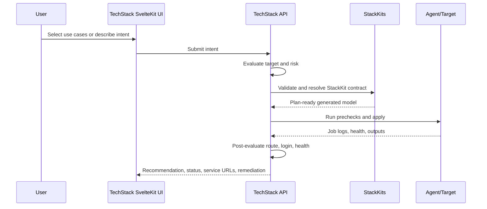

# StackKits Rollout Modes: Installer vs. CLI vs. kombify-TechStack

> Status: Draft
> Updated: 2026-04-23
> Scope: BaseKit first, with kombify standard SvelteKit apps as the initial application use case.

## Decision

StackKits should support three user-facing rollout modes. All three must converge on the same StackKits contract:

1. **Install Engine / One-Liner** for users who want the full homelab rollout from one short command.
2. **StackKits CLI Tool** for operators who want to install the CLI and run the technical steps themselves.
3. **kombify-TechStack UI** for users who want guided use-case/intent selection, node inventory, job status, agent handling, and day-2 operations.

The Install Engine is a productized wrapper over the CLI flow. It installs the CLI, installs the selected kit definitions, prepares the host, initializes the kit, generates artifacts, applies the stack, and prints the access summary. It is not a separate architecture.

The CLI Tool is the manual technical interface to the same StackKits engine. TechStack is the UI/control-plane interface to the same StackKits engine.

## First-level decision surface

The first product decision is not "which binary do I run?". It is **direct StackKits execution** versus **guided TechStack outcome selection**. Install Engine and CLI are both direct StackKits paths; they differ only in how much technical control the user keeps.

| Question | Direct StackKits: Install Engine or CLI | TechStack UI |
| --- | --- | --- |
| What does the user decide first? | **Where should StackKits run, and do I want one-command automation or explicit CLI control?** | **What outcome/use cases do I want?** |
| Canonical action | Install Engine: `curl -sSL base.stackkit.cc \| sh`; CLI: `stackkit init <standard>` -> `stackkit apply`. | UI action/job, no shell one-liner. |
| How is the CLI installed? | Install Engine includes it. CLI-only use can install through package/release/Git; today `curl -sSL install.stackkit.cc \| sh` is the documented CLI install script. | Not user-facing; TechStack workers call StackKits. |
| Who chooses the StackKit standard? | Install Engine encodes or prompts for the standard; CLI users choose explicitly with `stackkit init base-kit`, `modern-homelab`, or `ha-kit`. | TechStack asks StackKits to resolve the standard from intent, target evaluation, and policy. |
| What does the user type or click? | One installer command or explicit CLI commands/spec values. Guided installer prompts should mirror the first TechStack questions. | Use-case clicks, intent text, target/agent selection, confirmation. |
| Where is the intelligence? | StackKits standards, add-ons, auth baseline, route defaults, constraints, and validation. | Same StackKits standards, plus TechStack pre-evaluation, job orchestration, post-evaluation, and remediation. |
| What happens after apply? | Installer/CLI prints access summary, URLs, and next commands; user checks `stackkit status`. | TechStack runs post-evaluations: health, route, login path, job status, remediation hints. |

Minimum product rule: **StackKits owns the homelab standards; the Install Engine automates them, the CLI exposes them technically, and TechStack turns them into outcome choices.**

## Current state

| Area | Current state |
| --- | --- |
| Verified StackKits path | Level 0 BaseKit default is verified locally on Docker Desktop: Traefik, socket-proxy, TinyAuth, Vaultwarden, Jellyfin. |
| CLI contract | `stackkit init`, `prepare`, `generate`, `plan`, `apply`, `status`, and `remove` exist as the canonical standalone path. The CLI writes `stack-spec.yaml` and reads `stack-spec.yaml` or, when the default is missing, `kombination.yaml`. |
| Product intent naming | `stack-spec.yaml` remains the canonical CLI file. `kombination.yaml` is accepted as the TechStack/user-intent read alias. |
| Public docs | StackKits and TechStack are documented separately, but there is no guide that tells users when to use the Install Engine, CLI Tool, or TechStack UI for the same app outcome. |
| Internal docs | Core docs define Tool Boundaries and separate Stack/StackKits internals, but they do not yet document the joint rollout contract for standard SvelteKit apps. |
| SvelteKit app rollout | Minimal BaseKit app contract is implemented for `apps.<name>` with `kind: sveltekit`, image, port, route auth, health, env, and secret references. `stackkit generate` emits `apps.tf`. |

## Target state

The target user experience is:

> User chooses "deploy my SvelteKit app", supplies the minimal app and server details, reviews the plan, clicks apply, and receives a working route behind the login gateway with a functional user/session path.

Both rollout modes should produce the same effective deployment:

- BaseKit remains the first supported kit.
- StackKits CUE remains the source of truth for app shape, defaults, constraints, generated OpenTofu, Docker resources, routes, and health checks.
- The SvelteKit app is an L3 application module behind the platform gateway.
- The default route is protected by the login gateway unless explicitly marked public.
- The app exposes the canonical `/health` endpoint.
- Secrets are referenced, injected, or mounted by the selected execution path; they are never hard-coded in docs or generated public examples.

## Mode A: Install Engine / One-Liner

### User promise

"I paste one short command on the machine that should become my homelab. The installer does the rest and asks only blocking questions."

### Required user decisions and actions

| Step | User action | Required value |
| --- | --- | --- |
| 1 | Choose execution place | Usually the target Linux/macOS host with root/sudo access |
| 2 | Choose installer mode | Default/no-care or guided prompts |
| 3 | Choose one-liner | General default or kit-specific URL |
| 4 | Answer blocking prompts | Admin email, domain/access, app artifact only if not inferable |
| 5 | Read result | Service URLs, login credentials, next commands |

### Canonical commands

```bash
curl -sSL base.stackkit.cc | sh
```

The direct per-kit command contract is:

```bash
curl -sSL base.stackkit.cc | sh      # BaseKit
curl -sSL modern.stackkit.cc | sh    # Modern Homelab
curl -sSL ha.stackkit.cc | sh        # High Availability
```

The Install Engine has two UX modes:

| Mode | User experience | What happens |
| --- | --- | --- |
| Default/no-care | User runs one command and accepts StackKits defaults. | Install CLI + kit definitions, prepare Docker/OpenTofu, init, generate, apply, print URLs. |
| Guided prompts | User answers the same first questions TechStack would ask in UI. | Same flow, but installer asks for missing decisions such as access/domain/app facts. |

### Best fit

- Fastest "I just want the homelab" path.
- Demo, test-user, or non-technical first install.
- Default StackKits rollout with minimal deliberate choices.

## Mode B: StackKits CLI Tool

### User promise

"Install the CLI only. I will choose the standard, edit the spec, and run the deployment steps myself."

### Required user decisions and actions

| Step | User action | Required value |
| --- | --- | --- |
| 1 | Install CLI | `curl -sSL install.stackkit.cc | sh` |
| 2 | Choose working directory | e.g. `my-homelab` |
| 3 | Choose StackKit standard | `base-kit`, `modern-homelab`, or `ha-kit` |
| 4 | Fill deployment values | Domain/access mode, target host if remote, selected services/use cases |
| 5 | Fill SvelteKit app values | Image, port, hostname, health path, env, secret refs |
| 6 | Approve rollout | `stackkit plan` then `stackkit apply` |

### Command shape

```bash
curl -sSL install.stackkit.cc | sh
mkdir my-sveltekit-stack
cd my-sveltekit-stack
stackkit init base-kit
# add the SvelteKit app block to stack-spec.yaml
stackkit prepare
stackkit generate
stackkit plan
stackkit apply
stackkit status
```

### Ownership

| Concern | Owner |
| --- | --- |
| User-facing flow | Install Engine for Mode A, `stackkit` CLI for Mode B |
| Blueprint contract | StackKits CUE |
| Generated artifacts | StackKits generator |
| Execution | Local or SSH target through CLI/OpenTofu/Docker |
| Persistent run state | `.stackkit/state.yaml` plus OpenTofu state |
| UX surface | Terminal output, status command, generated service URLs |

### Best fit

- Single operator or developer.
- Local, lab, or small VPS deployment.
- Reproducible infrastructure from files.
- No need for team dashboard, node inventory, approvals, or background jobs.

## Mode C: kombify-TechStack UI

### User promise

"Open the SvelteKit UI, answer the wizard, connect a node or agent, review the plan, click apply, and watch the rollout."

### Required user decisions and actions

| Step | User action | Required value |
| --- | --- | --- |
| 1 | Choose outcome | Use-case chips such as media, vault, app hosting, or free-text intent |
| 2 | Select target | Existing node, new server, or agent join flow |
| 3 | Provide missing facts | Domain/access preference, app image or repository, secrets source |
| 4 | Review recommendation | TechStack shows the StackKits-resolved standard, add-ons, auth/routing defaults, and orchestration risk flags |
| 5 | Approve rollout | Click apply |
| 6 | Read result | Service URLs, login state, health, failed checks, remediation |

TechStack adds orchestration evaluation before and after StackKits apply:

| Phase | Evaluation |
| --- | --- |
| Before apply | Intent normalization, StackKits resolution, node/resource fit, port/DNS/security checks, plan risk. |
| After apply | Container health, route resolution, login-gateway path, `/health`, reachable service URLs, remediation suggestions. |

### Flow



### Ownership

| Concern | Owner |
| --- | --- |
| Guided UI | kombify-TechStack SvelteKit app |
| Run/job state | kombify-TechStack |
| Node inventory and agent connection | kombify-TechStack |
| Blueprint contract | StackKits CUE |
| Generated artifacts | StackKits generator |
| Execution | TechStack worker/agent invoking the StackKits execution boundary |
| UX surface | Dashboard, job timeline, health, service URLs, retry/rollback controls |

### Best fit

- Non-technical user.
- Team or managed customer setup.
- Multi-node or day-2 operations.
- Need for audit trail, background jobs, live status, retries, or a guided app catalog.

## Standard SvelteKit app contract

The first app use case should be intentionally small and robust.

| Field | Required | Purpose |
| --- | --- | --- |
| App name | Yes | Stable service and route identifier. |
| Artifact | Yes | Prefer a container image, e.g. `ghcr.io/<owner>/<app>:<tag>`. |
| Runtime port | Yes | Default SvelteKit Node adapter port is usually `3000`. |
| Public origin | Yes | Drives `ORIGIN` and route generation. |
| Hostname | Yes | Final route, e.g. `app.home.localhost` or `app.family.home`. |
| Health path | Yes | Canonical `/health`; `/api/health` may be accepted as a compatibility alias only if mapped. |
| Auth policy | Yes | Default `login-gateway`; public routes require explicit opt-out. |
| Environment | Optional | Non-secret runtime values such as `PUBLIC_*`. |
| Secret references | Optional | Doppler/env/agent references, never literal secrets in docs. |
| Resource limits | Optional | CPU/memory defaults from BaseKit context. |

Example target intent shape:

```yaml
stackkit: base-kit

network:
domain: home.localhost

apps:
  web:
    kind: sveltekit
    image: ghcr.io/kombify/example-sveltekit:latest
    port: 3000
    route:
host: app.home.localhost
      auth: login-gateway
    health:
      path: /health
    env:
      PUBLIC_APP_NAME: Example
```

## Comparison matrix

| Dimension | Install Engine / One-Liner | CLI Tool | TechStack UI |
| --- | --- | --- | --- |
| Entry point | Short shell command | CLI commands | SvelteKit web UI/API |
| Primary action | `curl -sSL base.stackkit.cc \| sh` | `stackkit init <standard>` -> `stackkit prepare/generate/plan/apply` | UI wizard/API intent |
| Install step | Included by the Install Engine | Package/release/Git install, or today `curl -sSL install.stackkit.cc \| sh` for CLI-only installation | TechStack worker/runtime concern |
| User model | Run one command, answer only blocking prompts | Operator selects technical standard and edits/accepts generated spec | User selects use cases or describes intent |
| Standard selection | Encoded by one-liner or installer prompt, resolved by StackKits | Explicit user choice, resolved by StackKits | StackKits recommendation/resolution shown through TechStack |
| Execution | Installer calls CLI flow automatically | User runs CLI flow manually | Worker/agent job path |
| Standards intelligence | StackKits CUE defaults, add-ons, baselines, constraints, validation | Same StackKits intelligence | Same StackKits intelligence, presented as guided recommendation |
| Orchestration intelligence | Installer automates prepare/init/generate/apply | User interprets CLI output and status | TechStack adds pre-evaluation, risk scoring, job state, post-evaluation, remediation |
| Feedback | Installer access summary | CLI output and `stackkit status` | Job timeline, logs, health, service URLs, remediation |
| State | Local homelab dir + `.stackkit` + OpenTofu state | Local `.stackkit` and OpenTofu state | TechStack run state plus StackKits/OpenTofu state |
| Best for | Fastest default install | Technical operators and reproducible file workflow | Managed UX, customers, day-2 operations |
| Must not do | Fork the CLI/StackKits logic | Become a separate product contract | Reimplement StackKits generation logic |

## Contradictions to resolve

1. **`kombination.yaml` vs. `stack-spec.yaml`:** Resolved for CLI reads: `stack-spec.yaml` remains canonical and `kombination.yaml` is accepted as an alias when the default is missing. Export/import semantics still need to stay documented as the TechStack adapter matures.
2. **Legacy `kombify validate/generate` examples:** StackKits docs must not reintroduce old `kombify validate` / `kombify generate` standalone examples. The standalone path is `stackkit`.
3. **One-liner meaning:** `base.stackkit.cc` is the full Install Engine path; `install.stackkit.cc` is CLI-only installation. They must not be conflated.
4. **TechStack duplication risk:** TechStack must orchestrate StackKits, not fork service defaults, add-on standards, baselines, generated artifacts, or CUE validation.
5. **V6 overpromise risk:** Public docs must distinguish the current robust BaseKit subset from the broader V6 target until the full default set is verified.

## Documentation split

| Surface | Purpose |
| --- | --- |
| StackKits repo concept file | Working comparison and source material for docs. |
| Mintlify How-To | Public, outcome-focused guide: choose CLI or TechStack and deploy a standard SvelteKit app. |
| Core internal docs | Detailed architecture, ownership boundaries, target contract, acceptance criteria, and next implementation steps. |

## Next implementation steps

1. Add the public Mintlify How-To under the StackKits tab.
2. Add the internal Core doc under Tools > StackKits.
3. Done: keep `stack-spec.yaml` as canonical CLI output and accept `kombination.yaml` as a read alias when the default is missing.
4. Done: add a minimal SvelteKit app contract to BaseKit with image, port, route, auth, health, env, and secret reference fields.
5. Done: add a VM smoke test that verifies `stackkit apply` exposes the app route and `/health` behind the expected routing/auth policy.
6. Add a TechStack adapter contract that invokes StackKits for validate/generate/plan/apply rather than generating deployment assets independently.
7. Validate on local Docker or test VPS/simulation environments only; do not use IONOS production servers for this rollout work.
