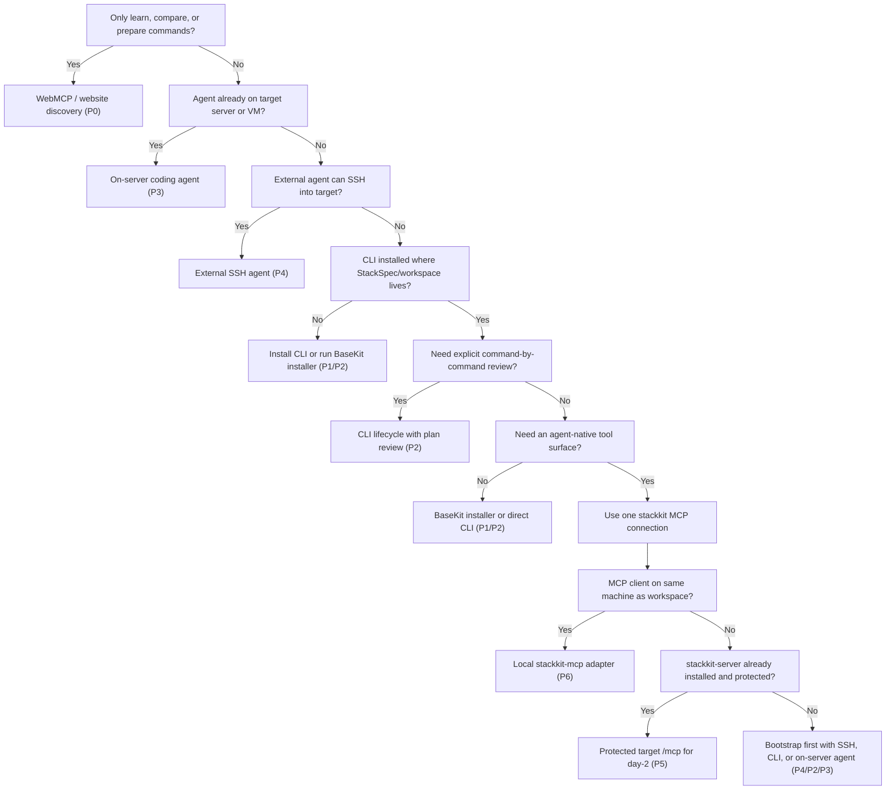

# StackKits Installation Methods

StackKits has multiple installation paths. Choose by the same three pillars every time:

- Configuration / individualization: how much the user can decide before rollout.
- Access options: where the agent or user can execute, and which authority boundary applies.
- Automation degree: how much of the lifecycle runs without typing every command.

User-facing MCP model: configure one MCP connection named `stackkit`.

| Runtime form | User-facing meaning |
| --- | --- |
| `stackkit-mcp` stdio/loopback | Local adapter for the `stackkit` MCP connection |
| `stackkit-server POST /mcp` | Same `stackkit` MCP connection as a protected durable endpoint after install |
| `mcp-use/stackkits-app` | App authoring/build layer only, not a production connector |

## Core Decisions

Every install path should collect the same decisions:

| Decision | Typical choices |
| --- | --- |
| StackKit | `base-kit` beta only |
| Owner/admin email | Operator email, tenant owner, or synthetic local-only test email |
| Install mode | `bare`, `bootstrapped`, `advanced` |
| Context | `local`, `cloud`, `pi` |
| Domain strategy | browser-native `.localhost`, `kombify.me`, custom domain, LAN DNS |
| Service profile | `default`, `admin-only` |
| Platform/PaaS | Coolify default, Komodo beta-supported, Dokploy draft |
| Authority | none, shell, SSH, local MCP process, protected target MCP |
| Approval | preview only, shell apply approval, or MCP write gate |

StackKits config can express these choices through `stack-spec.yaml`, CLI flags, installer env vars, and `stackkit-server` env/flags. Generated `deploy/`, `.stackkit/`, OpenTofu, Compose, tfvars, snapshots, and logs are outputs and must not be hand-edited.

## Axes

Automation:

| Level | Meaning |
| --- | --- |
| `A0` | Discovery only: website, `llms.txt`, OpenMCP. No target actions. |
| `A1` | Manual CLI: user runs every lifecycle command. |
| `A2` | Guided agent: agent runs/proposes steps and asks for missing intent/approval. |
| `A3` | Autonomous approved rollout: installer or agent executes the full approved lifecycle. |
| `A4` | Durable connector operation: external agent uses the target-local MCP connector after install. |

Individualization:

| Level | Meaning |
| --- | --- |
| `I0` | Default BaseKit path. |
| `I1` | Email, stack name, workspace, and spec path. |
| `I2` | Kit, install mode, context, compute tier, service profile. |
| `I3` | Domain strategy, SSH target, DNS/TLS, selected PaaS. |
| `I4` | Advanced owner/recovery policy, update/rollback, advanced composition. |

## Process Matrix

| ID | Process | Automation | Individualization | Main entrypoint |
| --- | --- | --- | --- | --- |
| `P0` | Website and Web-MCP discovery | `A0` | `I0-I4` planning | `https://stackkit.cc/openmcp.json` |
| `P1` | Full BaseKit one-line installer | `A3` | `I0-I3` | `curl -sSL https://base.stackkit.cc \| sh` |
| `P2` | Shared CLI installer plus direct CLI | `A1-A2` | `I0-I4` | `curl -sSL https://install.stackkit.cc \| sh` |
| `P3` | Agent already on target server | `A2-A3` | `I0-I4` | CLI plus public prompts |
| `P4` | External agent through SSH | `A2-A3` | `I1-I4` | SSH plus installer/CLI |
| `P5` | Protected durable StackKits MCP endpoint | target `A4` | `I1-I4` | Protected `POST /mcp` after install |
| `P6` | Local StackKits MCP adapter | `A2` | `I1-I4` | `stackkit-mcp` |

## Three-Pillar Comparison

| Method | Configuration / individualization | Access options | Automation degree |
| --- | --- | --- | --- |
| CLI | Low-to-full. One-line BaseKit uses env vars; direct CLI supports full StackSpec and plan review. | Direct target shell, operator shell, or commands run over SSH. | Manual to highly automated. |
| Native MCP | Medium-to-full through typed tools and the MCP App onboarding resource. | Same-machine `stackkit-mcp`, or protected target `stackkit-server /mcp` after install. | Guided locally; durable day-2 remotely. |
| WebMCP / website discovery | Broad planning only; no config write and no target mutation. | Public website, `/openmcp.json`, docs, schemas, OpenAPI. | `A0`: discovery only. |
| External SSH | Medium-to-full; strong for remote host, email, domain, mode, evidence. | Agent outside the server with SSH or equivalent remote shell. | `A2-A3`: guided remote bootstrap. |
| On-server coding agent | Full if the agent has enough target context and approval. | Agent already has the target shell. | `A2-A3`: guided to autonomous. |

Expanded internal comparison:

| Process | Configuration / individualization | Access options | Automation degree |
| --- | --- | --- | --- |
| `P0` Website and Web-MCP discovery | Broad planning only. Agent can collect email, kit, mode, domain, target, and approval intent. | Public website, browser, read-only OpenMCP. No target authority. | Discovery only. |
| `P1` Full BaseKit one-line installer | Low to medium. Defaults plus env vars for email, mode, service profile, domain, context, PaaS. | Direct target shell, on-server agent, or external agent over SSH. Needs root/sudo for preparation. | One approved command runs the main lifecycle. |
| `P2` Shared CLI installer plus direct CLI | Full range. Best for StackSpec review, plan review, custom network/platform, advanced owner/recovery choices. | Local shell on target or operator-controlled shell. | Manual or guided step-by-step. |
| `P3` Agent already on target server | Full range if the agent has local context and approval. | Agent has target-shell authority. Website is guidance only. | Guided to autonomous. |
| `P4` External agent through SSH | Medium to full. Strong for remote host, SSH, email, domain, custom mode, remote evidence. | Agent outside server with SSH/remote-shell authority. | Guided remote bootstrap. |
| `P5` Protected durable StackKits MCP endpoint | Medium to full through typed tools and MCP App onboarding. Best for day-2 config/update/verify/log workflows. | Agent connects to an already-running target `stackkit-server /mcp` through a protected endpoint, tunnel, VPN, or private network. Token and write gate required for mutation. | Target durable connector operation, not the default first-install path. |
| `P6` Local StackKits MCP adapter | Medium to full on the local workspace. | Same-machine MCP client via `stackkit-mcp`. If launched through SSH, the boundary is still SSH/P4. | Guided local MCP workflow through the same `stackkit` connection. |

Decision rule:

- Use `P1` for the fastest fresh-server BaseKit install.
- Use `P2` for maximum customization and explicit review.
- Use `P3` when the agent already runs on the target.
- Use `P4` when an external agent must bootstrap a server before MCP exists.
- Use `P5` only when `stackkit-server /mcp` already exists, is explicitly protected, and the goal is durable StackKit-owned day-2 management.
- Use `P6` when the MCP client and workspace are on the same machine.

## Decision Tree



## P0, P4, P5, And P6

| Path | Meaning | Boundary |
| --- | --- | --- |
| `P0` | Website/OpenMCP discovery. The agent learns what StackKits is and which execution path to use. | No target authority. |
| `P4` | External agent uses SSH or another remote shell to run the installer or CLI on the target. | SSH user privileges. |
| `P5` | External agent connects to an installed `stackkit-server /mcp` for durable read/verify/log/update workflows. | MCP auth, protected transport, and write gate. |
| `P6` | Local adapter form of the same `stackkit` MCP connection beside the CLI/workspace. | Local process authority. |

Typical flow:

```text
P0 discovery -> P1/P2/P3/P4 initial install -> optional P5 day-2 connector after stackkit-server is installed
```

## Current Options

Website and Web-MCP discovery:

- Read-only.
- Good for: agent learns StackKits, chooses an install path, asks for missing user intent.
- Does not execute target-server actions.

Full BaseKit installer:

```bash
curl -sSL https://base.stackkit.cc | sh
```

- Installs CLI/server/MCP/toolchain and runs the BaseKit lifecycle.
- Best for a fresh dedicated server and low-to-medium customization.
- For local-server tests, run it on the server itself: SSH session, VM/physical
  console, or an on-server agent. Default `*.home.localhost` links are local to
  that target/browser context and are not LAN-wide DNS records.
- Pin prerelease validation with:

```bash
env STACKKIT_RELEASE_VERSION=v0.4.5-beta.1 sh -c 'curl -sSL https://base.stackkit.cc | sh'
```

Shared CLI installer plus explicit lifecycle:

```bash
curl -sSL https://install.stackkit.cc | sh
stackkit init base-kit
stackkit prepare
stackkit validate
stackkit generate
stackkit plan
stackkit apply --verify
stackkit verify --http --json
```

- Best when the user or agent should review each step.
- Supports the widest individualization range.

Agent on the target server:

- Agent uses website prompts as guidance but executes locally through shell.
- Best when the agent is already inside an SSH session, VM console, or server job.

External agent through SSH:

- Agent is outside the server and bootstraps through SSH.
- Best before `stackkit-server /mcp` exists on the target.

External agent through native MCP:

```text
POST https://<protected-target>/mcp
GET  https://<protected-target>/openmcp.json
```

- Requires `stackkit-server` on the target.
- Non-loopback access must be tunnel/VPN/private-network/HTTPS protected and token-protected.
- Write tools require `STACKKIT_MCP_ALLOW_WRITE=true`.
- Target capability for StackKit-owned day-2 management after install, not the default first-install path.

Transport stance:

- Standard MCP remote transport is Streamable HTTP on a single `/mcp` endpoint.
- WebSocket would be a custom transport/gateway, not the default interoperable StackKits surface.
- Streamable HTTP uses client `POST` requests and optional server SSE streams for streamed responses or notifications.

Local MCP fallback:

```toml
[mcp_servers.stackkit]
command = "stackkit-mcp"
args = ["--mode", "docs,local,server"]
```

- Best when the MCP client runs on the same machine as the workspace.
- No public HTTP endpoint is needed.

## Authority Boundary

- Website discovery has no target authority.
- Installer and direct CLI have shell authority.
- SSH has remote-shell authority.
- Local MCP has local process authority.
- Remote MCP has target-local StackKits authority exposed through protected transport, token checks, and write gates.

`stackkit_apply` and `stackkit_rollout` skip platform app lifecycle by default in the MCP connector. The native MCP surface manages StackKits rollout/evidence, not customer app rollout, managed-serverless provisioning, or internal Kombify operator MCPs.
